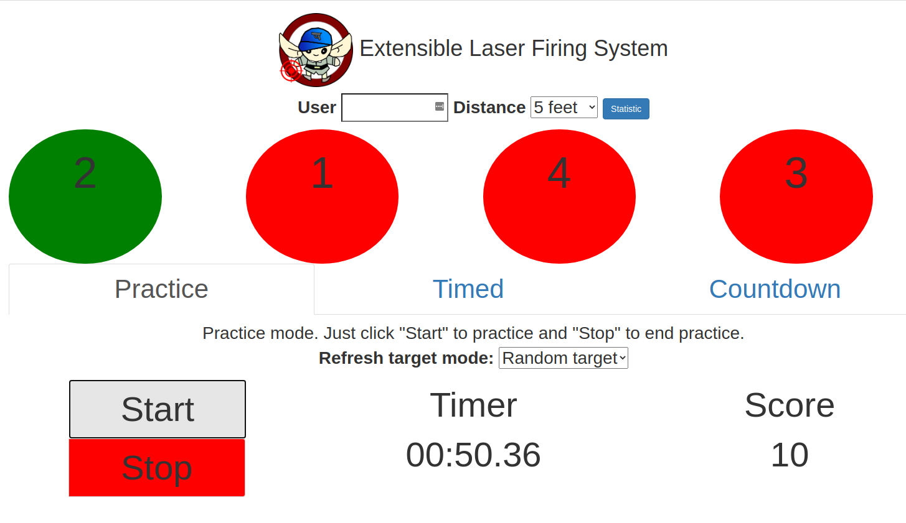
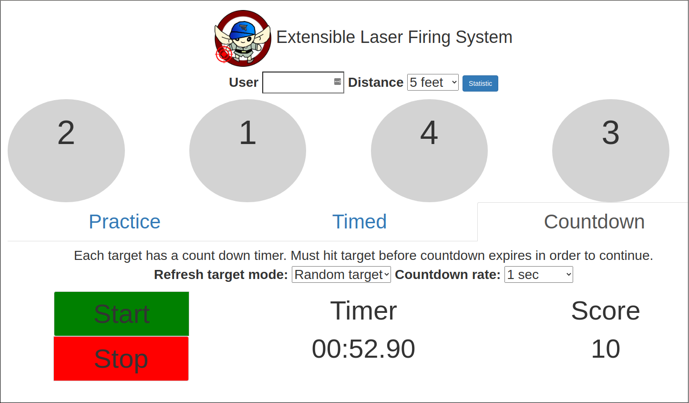
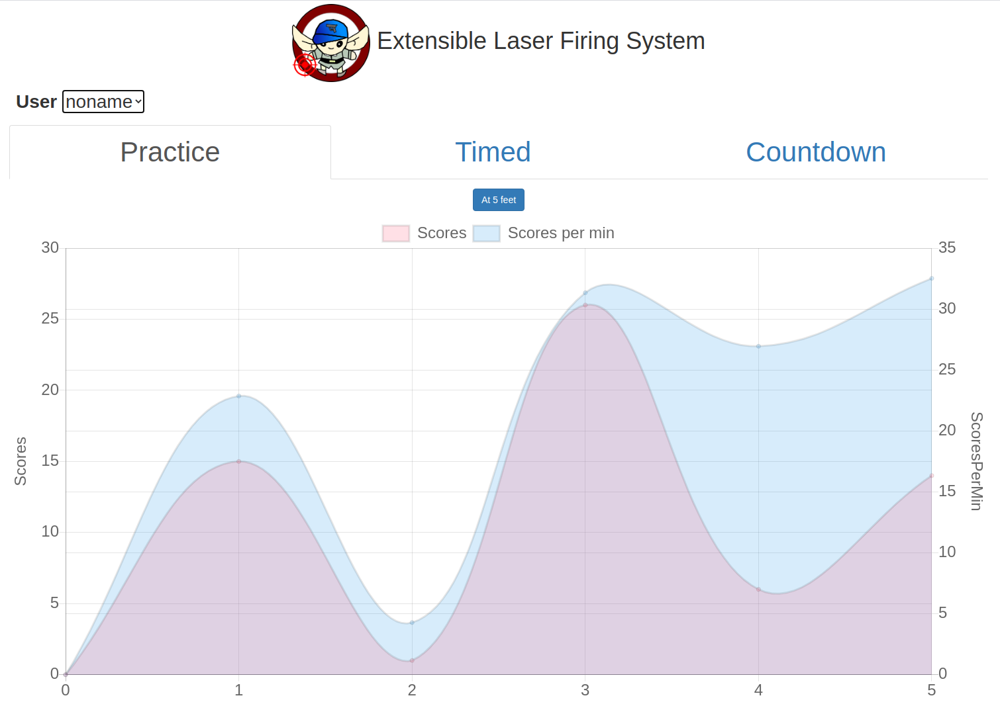

# Extensible Laser Firing System

Extensible Laser Firing System (ELFS) is an open source project intended to make firing practice fun and affordable at home. The project consists of one or more light dependent resistors acting as shooting targets. LED, actuators and a GUI act as feedback mechanism.

## Demo Video

## Snapshots

### Practice mode

#### Count down mode

#### Statistics

## Components

The project is composed of the following components:

* [Main controller](firmware/main-controller/README.md)
* [Target controller](firmware/target-controller/README.md)
* [User Interface](software/README.md)
* [Hardware](hardware/README.md)

Please refer to each of the components for more details about this project.
