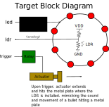
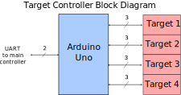

# Target controller

## Description

The target controller is responsible of detecting a laser hit in one of the light sensors and provide visual feedback to the user. The visual feedback consists of blinking a circular LED as well as triggering a solenoid to mimic the sound of a bullet hitting a metal plate.

The following diagram shows a sample target:

As we can see, each target has 3 ports:

* led: controls the current animation in the circular led
* ldr: analog voltage inversely proportional to the amount of light sensed by the light dependent resistor
* trigger: activates a relay that controls an actuator

The following diagram shows the target controller implemented using an Arduino Uno microntroller:

A total of 14 pins are required:

* 2 pins for RX/TX pins are used to communicate with the main controller (see [Main controller](../main-controller/README.md))
* 8 digital pins are used to control 4 LED strings and 4 actuators
* 4 analog pins are used to detect laser hits

## Requirements

(TODO)

## Installation

(TODO)

## Control

The target controller is managed by the main controller. See [common](../common/README.md) for the details on the control protocol.